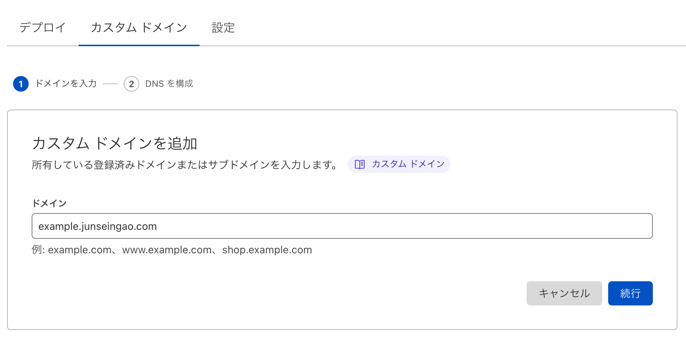
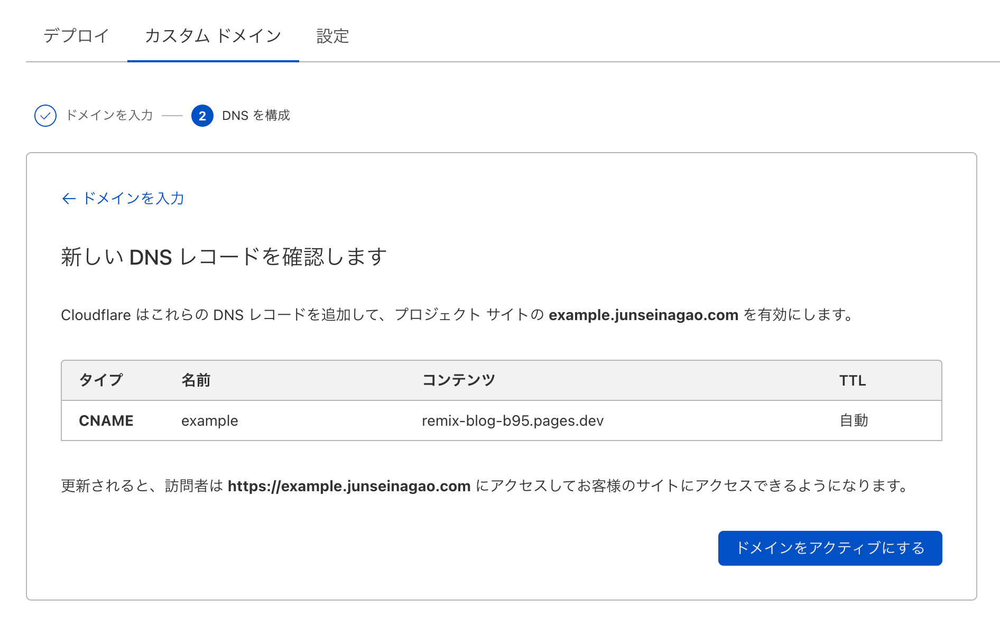

# Cloudflare Pagesのカスタムドメイン設定がすごい。

このブログは、Cloudflareでドメインを取得して DNS も Cloudflare を使っています。 Cloudflare Pages を使ったときにカスタムドメインの設定が楽すぎてビビりました。

## ① 「Pages」で「カスタムドメイン」を開く

## ② 追加したいカスタムドメインを入力する

自分の場合は、 `junseinagao.com` を持っているので、`example.junseinagao.com` と入力して次へ進みます。

## ③ 追加したいカスタムドメインを入力する

後は、 Cloudflare が設定してくれます。Awesomeかよ。

# 終わりに

Cloudflare はドメインを取得する時も色々設定しやすいように誘導してくれた記憶があります。
Cloudflare最高！

